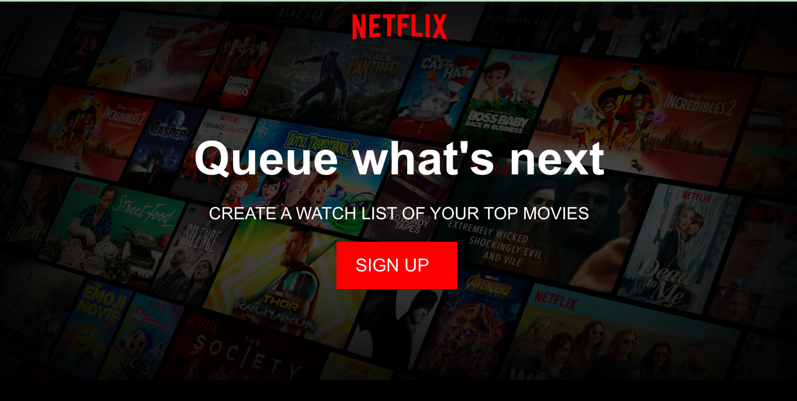
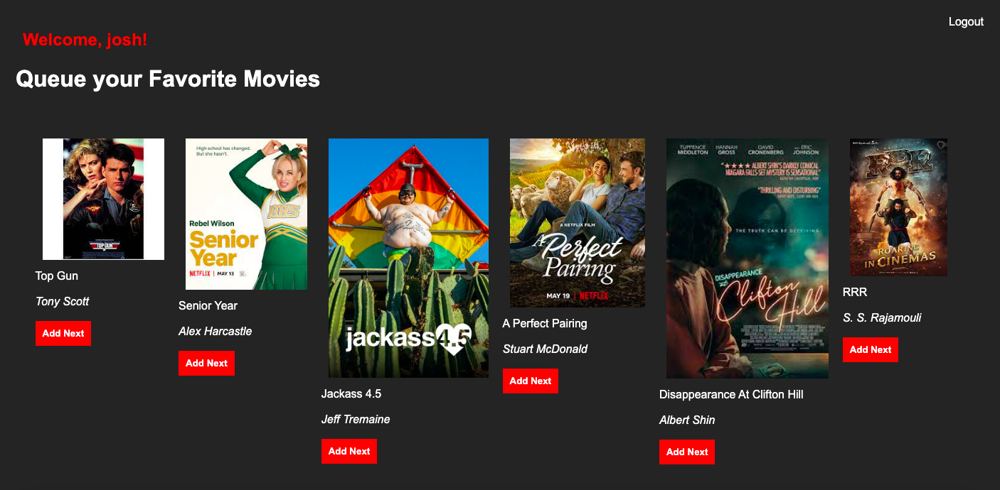
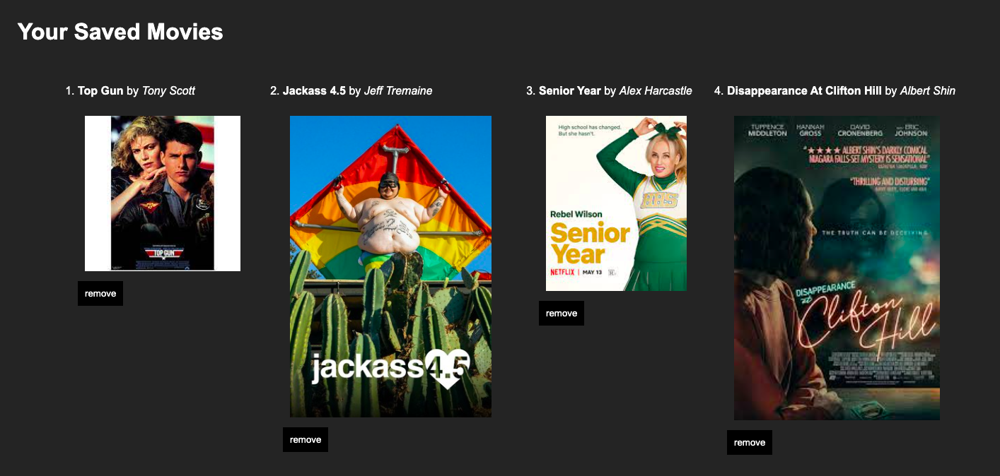

# Netflix-App

## What I've Learned
I had a lot of fun trying to model this app off of netflix. I learned the importance of keeping my routes clean and simple, and moving at a pace that enhaces my learning. In this project, I ran into a bug with user authentification, but realized I was passing the client-side EJS a different array than it needed. I'm excited about what more can be done with Passport.

## Tech Stack
Made using Javascript, CSS, EJS, Node.js, Express, and user authentification with Passport.
